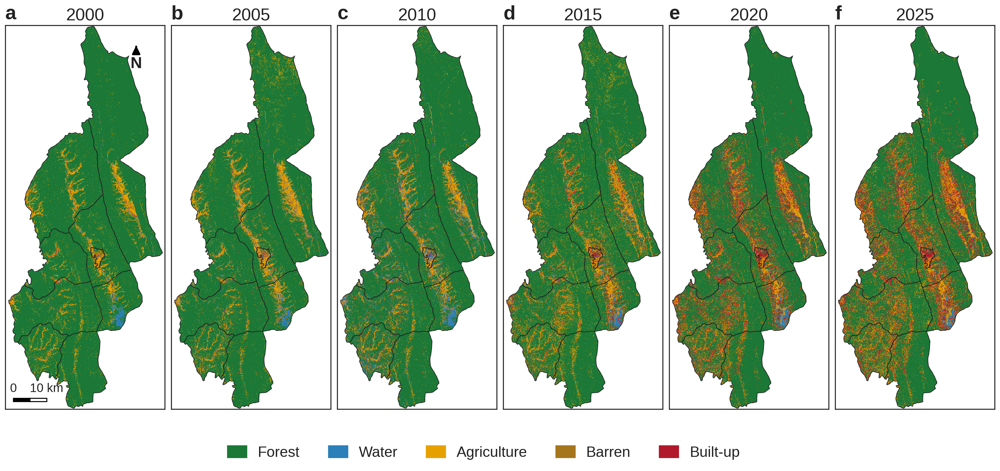

# Land-Use Change, Ecosystem Service Value and Its Spatial Transfer: Khagrachhari District, Chittagong Hill Tracts, 2000–2025

**Research project** · Manuscript in preparation

> **Status:** unpublished. This page shows the research question, study area, data and method overview only.
> **Full results and code will be released after publication.**

## Research question

The Chittagong Hill Tracts are among Bangladesh's most forested and ecologically sensitive landscapes, and settlement and farming are spreading along their valleys. This study asks:

1. How did land cover in Khagrachhari District change over 25 years (2000–2025, in five-year steps)?
2. How did those changes alter the economic value of the district's ecosystem services, once each pixel's ecological condition is taken into account?
3. How much value flows from the rural hill upazilas towards the urban core and periphery, given the terrain between them?
4. Which natural and human factors explain where value was lost or gained?

## Study area

**Khagrachhari District**, northern Chittagong Hill Tracts, Bangladesh: north–south ridges separated by narrow alluvial valleys. For the transfer analysis, the nine administrative units are grouped into three tiers: Khagrachhari Paurashava (urban core), the rest of Khagrachhari upazila (periphery) and seven rural upazilas (hinterland).

*Random-forest land-cover classifications for 2000–2025 (Landsat, Bangladesh Transverse Mercator 2010).*

## Data

| Dataset | Use | Resolution |
|---|---|---|
| Landsat 5 TM Collection 2 Level-2 (2000, 2005, 2010) | Land-cover classification, NDVI | 30 m |
| Landsat 8 OLI Collection 2 Level-2 (2015, 2020, 2025) | Land-cover classification, NDVI | 30 m |
| MODIS MOD17A3HGF v061 net primary production | Ecosystem condition | 500 m |
| SRTM DEM | Elevation and slope | 30 m |
| BBS Yearbook of Agricultural Statistics 2024 | Grain yield and farmgate price for valuation | District |
| BBS Population and Housing Census 2022 | Socio-economic factors | Administrative units |

## Method overview

- **Classification:** Google Earth Engine dry-season composites with cloud masking. A random forest classifier on a multi-band feature stack produces five classes (forest, water, agriculture, barren, built-up) for six epochs, followed by an accuracy assessment.
- **Change accounting:** transition matrices and dynamic-degree indices for each five-year interval.
- **Valuation:** the equivalent-factor (value-transfer) method, calibrated to local rice yield and price and adjusted pixel by pixel with an ecosystem-quality coefficient derived from NPP and vegetation cover, then aggregated to a 100 m grid.
- **Spatial transfer:** a breaking-point (gravity) model of value flow from the rural upazilas to the periphery and core. Its circulation coefficient comes from an ecological resistance surface (terrain, land cover, vegetation, value).
- **Drivers:** the geographical detector (factor, interaction, risk and ecological detectors) on grid-level value change.
- **Robustness:** sensitivity of the results to the value-coefficient table.

## Tools

Google Earth Engine · Python · ArcGIS (arcpy)

## Contact

Chinmoy Ghosh Shuvo · Open to collaboration and knowledge sharing. Feel free to reach out on [LinkedIn](https://www.linkedin.com/in/chinmoyghosh034).

*Full results and code will be released after publication.*
